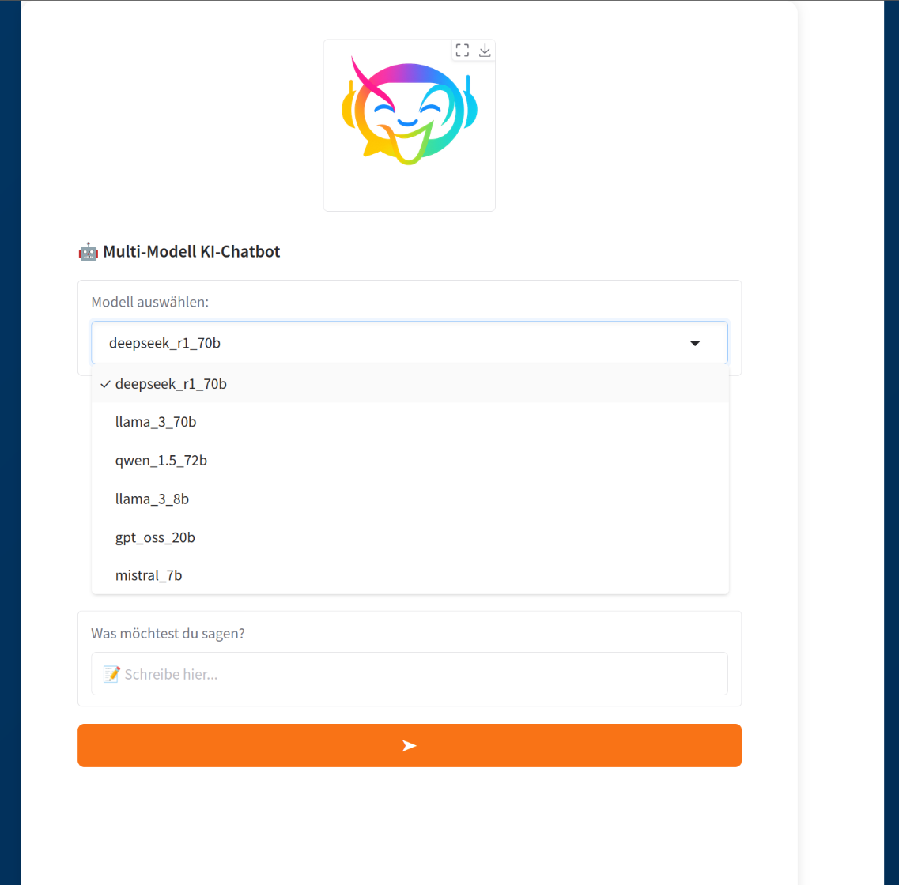
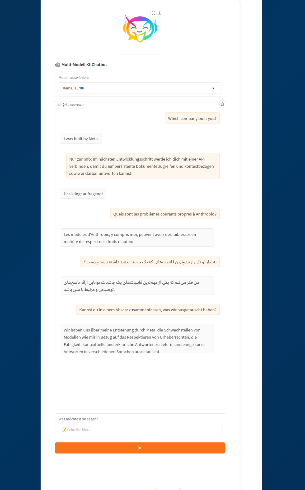

#  Multi-LLM Chatbot

> ⚠️ **Work in Progress**: This project is in early development.  
> Features, structure, and documentation will evolve quickly.

A multilingual **retrieval-augmented chatbot** powered by [LangChain](https://github.com/langchain-ai/langchain), [Together AI](https://github.com/togethercomputer/together-python), [FastAPI](https://fastapi.tiangolo.com/), and [pgvector](https://github.com/pgvector/pgvector), with the ability to easily switch between different Language models.


---

## Usage

```bash
# 1. Create and activate a new virtual environment
python -m venv .venv
source .venv/bin/activate

# 2. Install repo as a package
pip install -e .

# 3. Add your TogetherAI API key in the `.env` file

# 4. Start PostgreSQL + pgvector
docker compose up -d

# 5. Run FastAPI backend
uvicorn app.main:app --reload
# Docs available at: http://localhost:8000/docs

# 6. Run Gradio frontend
python app/gradio_app.py
```
**Open http://127.0.0.1:7860**

---
<!--
<h4 style="text-align: center;">Model Selection</h4>

<p align="center">
  
</p>

<h4 style="text-align: center;">Multilingual Multi‑Model Chatbot Demo v0.1.0</h4>

<p align="center">
  
</p>
-->