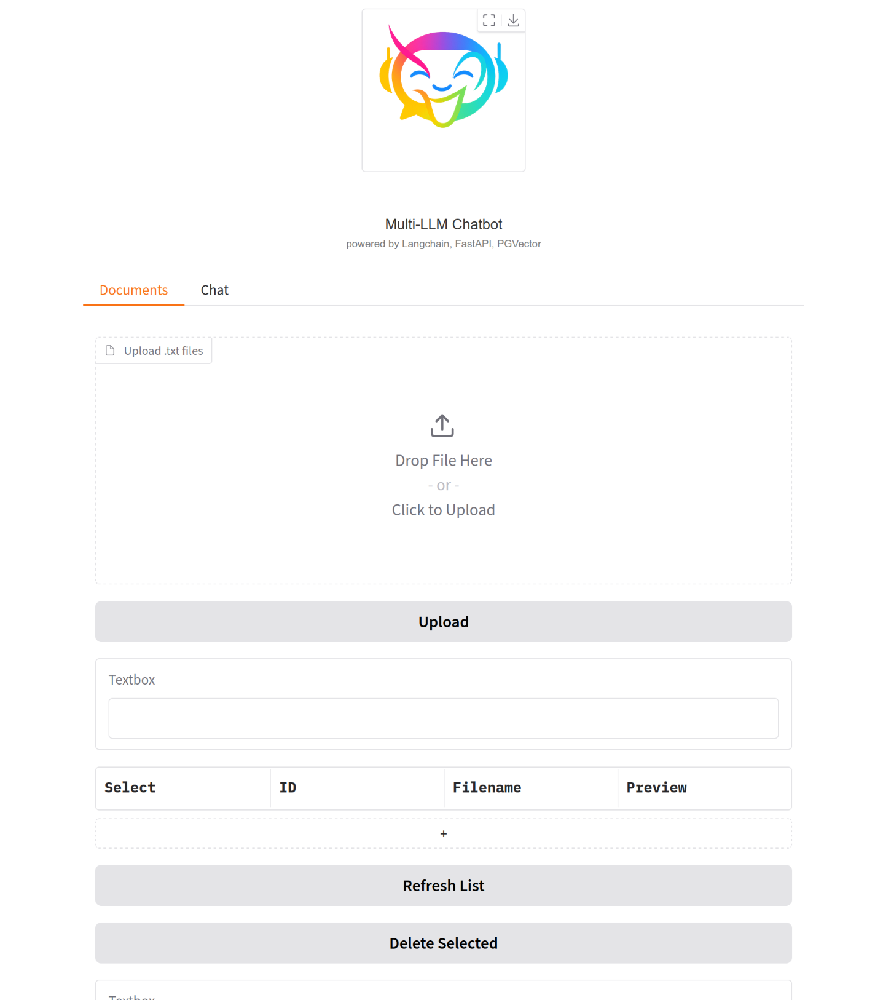

#  Multi-LLM Chatbot

> ⚠️ **Work in Progress**: This project is in early development.  
> Features, structure, and documentation will evolve quickly.

A multilingual **retrieval-augmented chatbot** powered by [LangChain](https://github.com/langchain-ai/langchain), [Together AI](https://github.com/togethercomputer/together-python), [FastAPI](https://fastapi.tiangolo.com/), and [pgvector](https://github.com/pgvector/pgvector), with the ability to easily switch between different language models.


---

## Usage

### Option 1: Local Development
```bash
# 1. Create and activate a new virtual environment
python -m venv .venv
source .venv/bin/activate

# 2. Install repo as a package
pip install -e .

# 3. Add your TogetherAI API key in the `.env` file

# 4. Start backend + frontend + db (hot reload)
make dev
```
### Option 2: Docker Compose
```bash
docker compose up --build
```

Backend API → http://localhost:8000/docs

Gradio UI   → http://localhost:7860


<h4 style="text-align: center;">Upload Document</h4>
<p style="text-align: center;">
  
</p>

<h4 style="text-align: center;">Select Model and Chat</h4>
<p style="text-align: center;">
  
</p>
